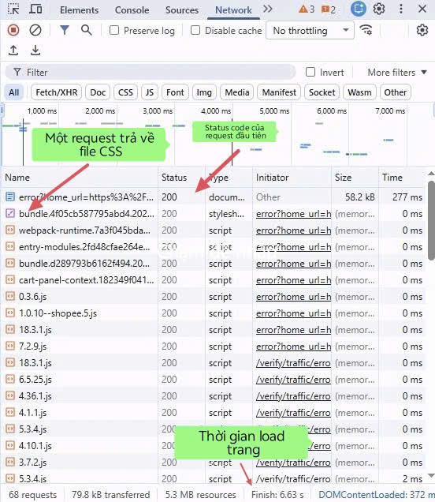

Câu A1 — HTTP & Browser
1. Các bước khi gõ URL và nhấn Enter:
- Bước 1 (DNS Lookup): Trình duyệt tìm kiếm địa chỉ IP của tên miền shopee.vn thông qua hệ thống phân giải tên miền (DNS).
- Bước 2 (TCP Connection): Trình duyệt thiết lập kết nối TCP với máy chủ bằng quá trình bắt tay 3 bước (3-way handshake).
- Bước 3 (TLS Handshake): Vì dùng https, quá trình thiết lập bảo mật TLS diễn ra để mã hóa dữ liệu.
- Bước 4 (HTTP Request): Trình duyệt gửi một HTTP GET Request tới máy chủ yêu cầu tải trang web.
- Bước 5 (HTTP Response): Máy chủ xử lý và trả về phản hồi chứa mã trạng thái (VD: 200 OK) kèm theo nội dung HTML của trang.
- Bước 6 (Rendering): Trình duyệt phân tích cú pháp HTML, tải thêm CSS/JS/Hình ảnh và render giao diện ra màn hình.

2. 
    Trong Google Chrome DevTools, tab Network cho ta thấy toàn bộ hoạt động mạng (network activity) giữa trình duyệt và server khi tải trang hoặc thực hiện request.


Câu A2 — Semantic HTML
Lý do trang web bị SEO thấp là vì lạm dụng thẻ <div> (div-itis), không cung cấp ý nghĩa cấu trúc cho công cụ tìm kiếm hoặc trình đọc màn hình.
4 lỗi semantic và cách sửa:
- Lỗi 1: div class="header" -> Sửa thành thẻ <header>.
- Lỗi 2: div class="menu" -> Sửa thành thẻ <nav> kết hợp với <ul>/<li> cho danh sách link.
- Lỗi 3: div class="main" -> Sửa thành thẻ <main>.
- Lỗi 4: div class="title" -> Sửa thành thẻ tiêu đề <h1> hoặc <h2>.
- Lỗi 5: div class="product" -> Sửa thành thẻ <article>.
```
<header>
    <div class="logo">ShopTLU</div>
    <nav>
        <ul>
            <li><a href="/">Trang chủ</a></li>
            <li><a href="/products">Sản phẩm</a></li>
        </ul>
    </nav>
</header>
<main>
    <article class="product">
        <h2>iPhone 16 Pro</h2>
        <p class="price">25.990.000đ</p>
        <figure class="image"></figure>
    </article>
</main>
<footer>© 2026 ShopTLU</footer>
```
Câu A3
____________________
Hộp 1               
Text A Text B
Hộp 2
Text C **Text D**
Hộp 3
___________________
Giải thích: 
- Thẻ `<div>` bao trọn 1 dòng nên các text hộp 1, hộp 2, hộp 3 sẽ nằm riêng 1 dòng trên trang web
- Text A, Text B, Text C  nằm trong thẻ `<span>` không nằm cùng dòng với thẻ `<div>`  và không có gì thay đổi 
- Thẻ `<strong>` in đậm từ Text D

Câu A4
1. Sự khác nhau giữa `<thead>`, `<tbody>`, `<tfoot>`:
- `<thead>`: Là phần đầu bảng chứa tiêu đề cột. Thường dùng `<th>`
=> Ý nghĩa:
    - Giúp trình duyệt và công cụ tìm kiếm hiểu cấu trúc bảng
    - Một số trình duyệt sẽ giữ header khi scroll
- `<tbody>`: Là phần thân bảng chứa dữ liệu chính => Đây là phần lớn nhất của bảng
- `<tfoot>`: Là phần cuối bảng. Chứa tổng kết / ghi chú
=> Thường dùng cho:
    - tổng tiền
    - thống kê
2. Tại sao không nên dùng table để tạo layout trang web?
- Sai mục đích sử dụng (semantic sai)
- `<table>` sinh ra để hiển thị dữ liệu dạng hàng/cột
- Dùng nó để chia layout (header, sidebar, content…) là lạm dụng HTML
=> Hậu quả:
    - Code khó hiểu
    - Không đúng chuẩn semantic HTML
- Khó bảo trì và chỉnh sửa
- Layout bằng table thường lồng nhiều bảng (nested tables)
=>Khi muốn thay đổi giao diện:
    - rất dễ vỡ layout
    - khó sửa một phần nhỏ
- So với CSS layout hiện đại thì cực kỳ bất tiện
- Không responsive tốt (kém trên mobile)
- Table cố định cấu trúc hàng/cột
- Khó co giãn theo màn hình nhỏ
=> Kết quả:
    - Trang web bị vỡ trên điện thoại
    - Scroll ngang khó chịu
- Hiệu năng và render chậm hơn
- Browser phải xử lý toàn bộ bảng trước khi hiển thị
- Layout phức tạp → render chậm hơn so với CSS layout


Câu C1
```html
<html lang="vi"> <!-- Xác định ngôn ngữ giúp SEO và accessibility -->
<head>
    <meta charset="UTF-8"> <!-- Bộ mã ký tự chuẩn -->
    <title>Chi tiết sản phẩm</title> <!-- Tiêu đề trang -->
</head>
<body>

    <!-- HEADER: chứa logo + điều hướng chính -->
    <header>
        <!-- NAV: nhóm các liên kết điều hướng -->
        <nav>
            <!-- danh sách link nên dùng ul/li để có cấu trúc rõ ràng -->
            <ul>
                <li><a href="#">Trang chủ</a></li> <!-- link điều hướng -->
                <li><a href="#">Danh mục</a></li>
                <li><a href="#">Liên hệ</a></li>
            </ul>
        </nav>
    </header>

    <!-- MAIN: nội dung chính của trang (chỉ nên có 1 main) -->
    <main>

        <!-- BREADCRUMB: dùng nav vì đây cũng là điều hướng -->
        <nav aria-label="breadcrumb">
            <!-- ol thể hiện thứ tự phân cấp -->
            <ol>
                <li><a href="#">Trang chủ</a></li>
                <li><a href="#">Điện thoại</a></li>
                <li>iPhone 16</li> <!-- item cuối không cần link -->
            </ol>
        </nav>

        <!-- SECTION: nhóm nội dung chính của sản phẩm -->
        <section>
            
            <!-- ARTICLE: đại diện cho 1 sản phẩm độc lập -->
            <article>

                <!-- Khu vực ảnh -->
                <div>
                    <!-- div dùng để layout nhóm ảnh -->
                     <!-- img hiển thị ảnh -->
                    
                    
                    
                    
                </div>

                <!-- Thông tin sản phẩm -->
                <div>
                    <h1>Tên sản phẩm</h1> <!-- h1: tiêu đề chính quan trọng nhất -->

                    <p>Giá sản phẩm</p> <!-- p: văn bản mô tả thông tin -->

                    <!-- Đánh giá sao -->
                    <div>
                        <!-- span dùng cho nội dung inline (sao, số rating) -->
                        <span>★★★★★</span>
                        <span>(100 đánh giá)</span>
                    </div>

                    <!-- Mô tả -->
                    <p>Mô tả sản phẩm...</p>
                </div>

            </article>
        </section>

        <!-- SECTION: thông số kỹ thuật -->
        <section>
            <h2>Thông số kỹ thuật</h2> <!-- tiêu đề phụ -->

            <!-- TABLE: dữ liệu dạng bảng -->
            <table>
                <thead>
                    <!-- thead: phần tiêu đề bảng -->
                    <tr>
                        <th>Thuộc tính</th> <!-- th: ô tiêu đề -->
                        <th>Giá trị</th>
                    </tr>
                </thead>
                <tbody>
                    <!-- tbody: dữ liệu chính -->
                    <tr>
                        <td>Ví dụ</td> <!-- td: ô dữ liệu -->
                        <td>Thông tin</td>
                    </tr>
                </tbody>
            </table>
        </section>

        <!-- SECTION: đánh giá -->
        <section>
            <h2>Đánh giá</h2>

            <!-- mỗi đánh giá có thể là 1 article -->
            <article>
                <p>Tên người dùng</p>
                <p>Nội dung bình luận</p>
            </article>

            <article>
                <p>Tên người dùng</p>
                <p>Nội dung bình luận</p>
            </article>
        </section>

        <!-- ASIDE: nội dung phụ (sidebar) -->
        <aside>
            <h2>Sản phẩm tương tự</h2>

            <!-- danh sách sản phẩm liên quan -->
            <ul>
                <li><a href="#">Sản phẩm 1</a></li>
                <li><a href="#">Sản phẩm 2</a></li>
                <li><a href="#">Sản phẩm 3</a></li>
            </ul>
        </aside>

    </main>

    <!-- FOOTER: thông tin cuối trang -->
    <footer>
        <p>Thông tin bản quyền</p>
    </footer>

</body>
</html>
```
Câu C2
Quan điểm “dùng `<div>` cho mọi thứ rồi thêm class là đủ” nghe có vẻ nhanh gọn, nhưng về kỹ thuật thì thiếu bền vững. Trước hết, SEO: công cụ tìm kiếm như Google không chỉ đọc nội dung mà còn dựa vào cấu trúc semantic để hiểu trang. Các thẻ như `<header>`, `<nav>`, `<article>`, `<section>`, `<footer>` giúp xác định phần nào là điều hướng, phần nào là nội dung chính, từ đó cải thiện khả năng lập chỉ mục và xếp hạng.

Thứ hai là accessibility: các trình đọc màn hình như NVDA hay JAWS sử dụng semantic HTML để giúp người khiếm thị “điều hướng” trang nhanh hơn. Nếu mọi thứ đều là `<div>`, người dùng phải nghe toàn bộ nội dung thay vì nhảy trực tiếp đến menu, nội dung chính hay phần bình luận — trải nghiệm rất kém.

Ví dụ cụ thể: một trang chi tiết sản phẩm. Nếu dùng `<nav>` cho breadcrumb và menu, người dùng có thể nhấn phím tắt để chuyển ngay đến vùng điều hướng. Nếu dùng `<main>` cho nội dung chính, screen reader có thể bỏ qua phần header lặp lại trên mọi trang. Những lợi ích này gần như không thể đạt được chỉ với `<div>` và class.

Tuy nhiên, `<div>` không phải vô dụng. Nó vẫn phù hợp khi bạn cần wrapper thuần túy cho layout hoặc styling, ví dụ nhóm các phần tử để áp dụng CSS Grid/Flexbox mà không mang ý nghĩa nội dung cụ thể.

Tóm lại, semantic HTML không phải “tốn thời gian”, mà là đầu tư đúng chỗ để code dễ hiểu, thân thiện hơn với máy tìm kiếm và người dùng.
